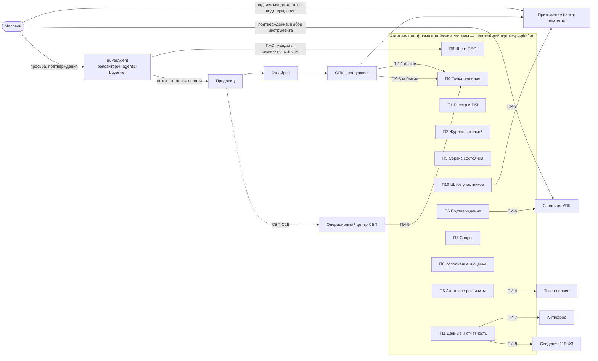

# Архитектура: Платформа платёжной системы и агент покупателя

## Общая картина

## Разделение ответственности

| Вопрос | Отвечает | Не отвечает |
|---|---|---|
| Кто такой агент | П1 Реестр | агент о себе в теле запроса |
| Что поручено | П2 Журнал, подпись принципала в банке | агент, продавец |
| Сколько осталось | П3 Сервис состояния | агент |
| Можно ли эту операцию | П4 ADP (агентские условия) + эмитент (финансовые) | продавец, агент |
| Чем платить | человек на странице УПК или в приложении банка | агент |
| Что произошло с операцией | события Платформы (П9) | пересказ продавца |
| Была ли операция в пределах | П7 сопоставлением с записью мандата | стороны спора |
| Что купить | агент и человек | Платформа |

## Два репозитория — один протокол

- **agentic-ps-platform** — Платформа, эмуляторы окружения (ОПКЦ, эмитенты, эквайрер, продавцы, СБП, УПК, токен-сервис), песочница. Владелец ПАО.
- **agentic-buyer-ref** — эталонный агент покупателя. Хранит копию `agent-protocol.yaml` с фиксированной версией и контрактные тесты. Свой эмулятор К1–К8 сохраняет только как лёгкий мок для модульных тестов; приёмка — против песочницы Платформы.

Изменение ПАО: `/decision` в репозитории Платформы → новая версия файла → в репозитории агента `/decision` о переходе на версию → контрактные тесты.

## Среды

| Среда | Что внутри | Для чего |
|---|---|---|
| dev | всё в памяти, один процесс | разработка, модульные тесты |
| sandbox | PostgreSQL, Платформа и эмуляторы окружения отдельными сервисами, docker compose | сценарии ПС01–ПС28 и 30 сценариев BuyerAgent |
| integration | адаптеры к реальным форматам ОПКЦ, СБП, токен-сервиса | только у оператора, вне этого репозитория |
| pilot | два банка-участника, малые суммы | данные для параметров |
