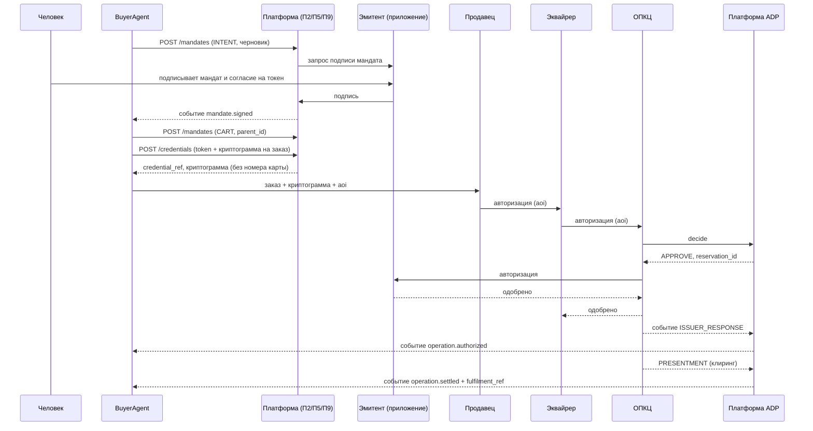
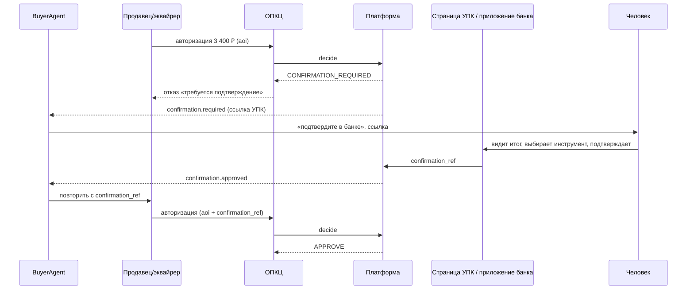
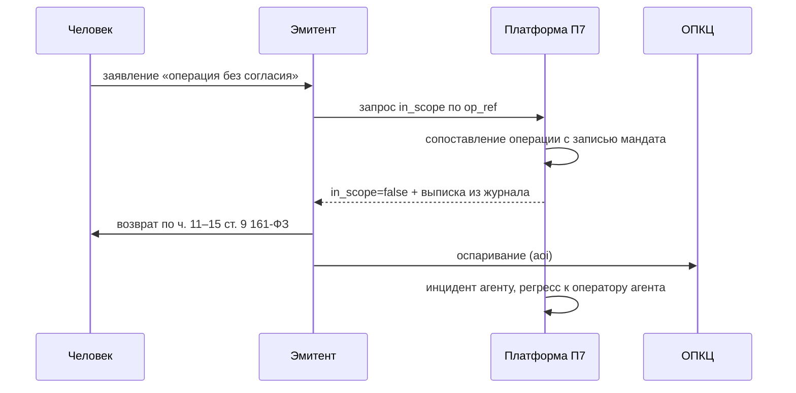

# Интерфейс Платформы с процессингом и системами оператора

Редакция 1 · 08.10.2026. Машиночитаемая часть: `processing-interface.yaml`.

## 0. Как читать

Конкретные номера полей, теги и коды ответов форматов ОПКЦ, СБП и токен-сервиса Платформе не известны: это внутренние альбомы оператора. Поэтому:
- Платформа работает с **канонической моделью сообщения** (раздел 2);
- для каждого внешнего формата пишется **адаптер** с таблицей соответствия. Места, где нужен номер поля или кода из альбома, помечены `[альбом]`;
- в песочнице адаптеры работают с эмуляторами, использующими каноническую модель напрямую (РП6).

## 1. Интерфейсы

| Код | Интерфейс | Направление | Тип | Назначение |
|---|---|---|---|---|
| ПИ-1 | Точка решения ADP | ОПКЦ → Платформа | синхронный запрос-ответ | Решение по агентской операции и резерв бюджета в пути авторизации |
| ПИ-2 | Признак в сообщениях процессинга | эквайрер → ОПКЦ → эмитент | расширение формата | Перенос `aoi` во всех сообщениях операции до спора |
| ПИ-3 | События операции | ОПКЦ → Платформа | асинхронный поток | Ответ эмитента, реверсал, клиринговое представление, возврат, оспаривание |
| ПИ-4 | Токен-сервис | Платформа ↔ токен-сервис | синхронный | Выпуск агентского токена, домен, криптограммы, приостановка |
| ПИ-5 | СБП | Платформа ↔ операционный центр СБП | синхронный + события | Агентские списания по привязке счёта, признак, возвраты |
| ПИ-6 | Универсальный платёжный код | Платформа ↔ оператор УПК | синхронный + редирект | Страница подтверждения и выбора инструмента |
| ПИ-7 | Антифрод | Платформа → антифрод; антифрод → Платформа | поток признаков + обратная связь | Признак, класс и уровень агента как входы модели; причины отказов |
| ПИ-8 | Участники | эмитенты и эквайреры ↔ Платформа | REST | Лимиты клиента, уведомления, отзыв, подпись мандата в приложении, знак готовности |
| ПИ-9 | Отчётность | Платформа → хранилище сведений об операциях | пакетный | Признак в сведениях по 115-ФЗ, выгрузки для надзора |

## 2. Каноническая модель агентской операции

```json
{
  "op_ref": "OPKC-20261008-000123",
  "msg_type": "AUTH_REQUEST",
  "channel": "CARD",
  "amount": 189000,
  "currency": "RUB",
  "merchant": { "id": "MER-1042", "mcc": "5462", "acquirer_id": "ACQ-01", "name": "Масса Мадре" },
  "instrument": { "kind": "AGENT_TOKEN", "token_ref": "tok_ag_7f2c", "cryptogram": "base64...", "issuer_id": "ISS-01" },
  "aoi": { "indicator": true, "agent_code": "nspk:agent:buyref-01:v3", "mandate_id": "MND-8f31c0", "fulfilment_ref": null },
  "confirmation_ref": null,
  "order_ref": "ORD-77a1",
  "ts": "2026-10-08T08:41:12Z"
}
```

`instrument.kind`: `AGENT_TOKEN` (карта «Мир» через агентский токен), `ACCOUNT_LINK` (привязка счёта СБП), `CARD_TOKEN` (обычный токен — тогда операция агентская только при наличии `aoi`).

Номер карты в каноническую модель не попадает никогда. Адаптер ОПКЦ передаёт в Платформу только ссылку на токен.

## 3. ПИ-1. Точка решения ADP

**Вызов:** `POST /adp/v1/decide`, тело — каноническая модель с `msg_type = AUTH_REQUEST`.

**Ответ:**

```json
{
  "decision": "APPROVE",
  "reason": null,
  "reservation_id": "RSV-55e1",
  "agent_level": 1,
  "mandate_left_after": 311000,
  "decided_in_ms": 7
}
```

`decision`: `APPROVE` · `DECLINE` · `CONFIRMATION_REQUIRED` · `BYPASS` (операция не агентская; процессинг продолжает без изменений).
`reason` — код из раздела 6.
Пары в ответе ADP (РП19): `APPROVE`, `BYPASS` — `reason: null`; `DECLINE` — код раздела 6, кроме `CONFIRMATION_REQUIRED` и `ADP_UNAVAILABLE`; `CONFIRMATION_REQUIRED` — `reason: CONFIRMATION_REQUIRED`. `ADP_UNAVAILABLE` ADP не возвращает: это решение процессинга при таймауте (`DECLINE` / `ADP_UNAVAILABLE`). Несогласованная пара — отказ, как неизвестный код (A3 п. 4.5).

**Требования:**
- p99 ≤ `adp_p99_ms`; процессинг ждёт не дольше `adp_timeout_ms`, затем отклоняет **агентскую** операцию кодом `ADP_UNAVAILABLE`;
- идемпотентность по `op_ref`: повтор возвращает прежнее решение, второй резерв не создаётся;
- `BYPASS` определяется по отсутствию `aoi` **и** неагентскому инструменту. Это первая проверка, стоимость ≤ `bypass_overhead_ms`;
- при `APPROVE` резерв создаётся атомарно в том же вызове.

**Режим «сам эмитент».** ADP выполняет проверки 1–6 раздела 6 SPEC и возвращает `APPROVE` без резерва. Эмитент вызывает `POST /participants/v1/state/reserve` (ПИ-8) сам.

## 4. ПИ-2. Признак в сообщениях процессинга

| Элемент признака | Каноническое поле | Формат | Место в сообщении ОПКЦ |
|---|---|---|---|
| Указание на агентский характер | `aoi.indicator` | 1 символ, `A` | `[альбом]` поле частного использования, субполе 1 |
| Код агента | `aoi.agent_code` | до 64 символов, `ns:id:ver` | `[альбом]` субполе 2 |
| Идентификатор мандата | `aoi.mandate_id` | до 32 символов | `[альбом]` субполе 3 |
| Ссылка на запись об исполнении | `aoi.fulfilment_ref` | до 32 символов, необязательно | `[альбом]` субполе 4 |
| Ссылка подтверждения | `confirmation_ref` | до 32 символов | `[альбом]` субполе 5 |

Правила (A1):
- признак формирует сторона, принявшая обращение агента, — продавец или эквайрер (A1 п. 4.1);
- эмитент вправе сформировать признак сам при выявлении агентского характера (п. 4.2);
- после формирования признак не изменяется (п. 4.3) и передаётся во всех сообщениях операции: авторизация, реверсал, представление, возврат, оспаривание (п. 5.1);
- указание без кода агента делает сообщение некорректным (п. 3.2).

Очереди внедрения (A1 п. 8.3): 1 — приём и передача; 2 — обязательное проставление; 3 — ответственность и обязательный отказ при неопознанном коде. В песочнице включены все три; для пилота очередь задаётся параметром `aoi_rollout_phase`.

## 5. ПИ-3. События операции

Поток от ОПКЦ к Платформе. Каждое событие несёт `op_ref`, `reservation_id` (если был), `aoi`.

| Событие | Действие Платформы |
|---|---|
| `ISSUER_RESPONSE` (одобрено / отказ) | Отказ эмитента → освобождение резерва |
| `REVERSAL` | Освобождение резерва |
| `PRESENTMENT` (полное или частичное) | Закрепление; запись об исполнении; событие агенту |
| `REFUND` | Возврат; бюджет — по `restore_budget_on_refund` |
| `CHARGEBACK` | Связь со спором П7; доказательства из журнала |
| `AUTH_EXPIRED` | Освобождение по `reservation_ttl` |

Доставка «не менее одного раза», обработка идемпотентна по `(op_ref, event_type, seq)`. События, пришедшие не по порядку (представление раньше ответа эмитента), ставятся в очередь до `event_reorder_window_ms`.

## 6. Коды решений и их соответствие кодам ответа

Агентские отказы отделены от отказов по лимиту и по фроду (A1 п. 5.3). Номера кодов ответа ОПКЦ назначает оператор — `[альбом]`.

| Код Платформы | Смысл | Код ответа ОПКЦ | Что видит агент (событие ПАО) |
|---|---|---|---|
| AOI_MISSING | Нет признака или кода | `[альбом]` «некорректное агентское сообщение» | `operation.declined` |
| AOI_MISMATCH | Код в признаке ≠ домену токена | `[альбом]` | `operation.declined` + инцидент |
| AGENT_UNKNOWN | Агента нет в реестре | `[альбом]` «агент не опознан» | `operation.declined` |
| AGENT_SUSPENDED | Допуск приостановлен | `[альбом]` | `agent.suspended` |
| CREDENTIAL_INVALID | Криптограмма неверна или использована | `[альбом]` | `operation.declined` |
| MANDATE_NOT_FOUND / EXPIRED / REVOKED | Мандат | `[альбом]` «нет полномочий агента» | `mandate.*` |
| MANDATE_SCOPE | Продавец или категория вне мандата | `[альбом]` «нет полномочий агента» | `operation.declined` |
| LIMIT_EXCEEDED | Превышено ограничение | `[альбом]` «превышение полномочий агента» | `operation.declined` |
| STATE_UNAVAILABLE | Состояние не подтверждено | `[альбом]` «превышение полномочий агента» | `operation.declined` |
| CONFIRMATION_REQUIRED | Нужно подтверждение | `[альбом]` «требуется подтверждение клиента» (аналог мягкого отказа) | `confirmation.required` |
| ADP_UNAVAILABLE | Таймаут ADP; код ставит процессинг (РП19) | `[альбом]` «агентская проверка недоступна» | `operation.declined` |

Продавец получает от эквайрера отказ с этим кодом. Агент узнаёт о результате событием ПАО от Платформы, а не от продавца — так агенту не нужно доверять пересказу продавца.

## 7. ПИ-4. Токен-сервис

| Операция | Вход | Выход |
|---|---|---|
| Выпуск агентского токена | `funding_ref` (ссылка эмитента на карту клиента), `agent_code`, `mandate_id`, `merchant_scope`, `valid_to` | `token_ref`, домен |
| Криптограмма на заказ | `token_ref`, `order_ref`, `amount_max`, `merchant_id` | одноразовая криптограмма, срок `cryptogram_ttl_sec` |
| Приостановка или удаление | `token_ref` или все токены `agent_code` | статус |

Выпуск токена требует согласия клиента в приложении эмитента — подпись мандата и согласие на токен объединяются в одно действие клиента. Номер карты Платформа и агент не получают никогда.

## 8. ПИ-5. СБП

- **Агентский инструмент** — привязка счёта клиента с ограничениями Платформы. Списание по привязке идёт по инициативе получателя: продавец через своего банка-участника.
- **Признак** передаётся в поле дополнительной информации сообщения C2B `[альбом]`; при отсутствии поля в стандарте на пилоте используется справочник «привязка → агент → мандат» в Платформе, а ADP вызывается операционным центром СБП по идентификатору привязки.
- **Возвраты** — штатный возврат СБП; событие `REFUND` в Платформу.
- **Удержания в СБП нет**: система переводит, а не хранит. Условное исполнение — вне Платформы.

## 9. ПИ-6. Универсальный платёжный код

Поверхность подтверждения, которая не принадлежит ни продавцу, ни агенту (F26):
1. На `CONFIRMATION_REQUIRED` Платформа создаёт запрос подтверждения с итоговыми значениями: продавец, состав, сумма, срок.
2. Человек получает ссылку или код УПК, открывает платёжную страницу, видит итог, **сам выбирает инструмент** и подтверждает.
3. Оператор УПК возвращает Платформе `confirmation_ref`, привязанный к итоговым значениям. Ссылка однократная, срок — `order_hold_sec`.
4. Продавец повторяет авторизацию с `confirmation_ref`; ADP проверяет совпадение итоговых значений.

Альтернатива — push в приложение эмитента (ПИ-8). Выбор канала — по настройке эмитента и клиента.

## 10. ПИ-7. Антифрод

- **В модель:** `aoi.indicator`, класс и уровень агента, возраст мандата, доля использования бюджета, признак дробления, история инцидентов агента.
- **Из модели:** причина отказа по фроду в обобщённой категории — для расчёта доли ложных отказов агентских операций (К14). Логика модели Платформе не раскрывается.
- **Метрика с первого дня:** доля отказов агентских операций по фроду против неагентских того же продавца.

## 11. ПИ-8. Участники

**Эмитент:**
- `PUT/GET /participants/v1/instruments/{funding_ref}/limits` — ограничения клиента; расширение только с подтверждением клиента, сужение сразу;
- `POST /participants/v1/mandates/{id}/sign` — подпись мандата клиентом в приложении (возврат результата в П2);
- `POST /participants/v1/principals/{ref}/revoke-all` — прекращение полномочий одним действием;
- `POST /participants/v1/confirmations/{id}` — подтверждение в приложении;
- `POST /participants/v1/state/reserve|commit|release` — режим «сам эмитент»;
- **вебхуки эмитенту** для уведомления клиента: первое использование полномочий, исчерпание бюджета, каждый отказ по превышению (ч. 4 ст. 9 161-ФЗ).

**Эквайрер:**
- `GET /participants/v1/agents/{code}/status` — проверка агента продавцом;
- `POST /participants/v1/merchants/{id}/readiness` — заявка на знак готовности (A5 п. 5).

## 12. ПИ-9. Отчётность

Признак, код агента и идентификатор мандата включаются в состав сведений об операциях (A1 п. 7.3; ст. 3 и 9 115-ФЗ). Формат выгрузки — `[альбом]`. В песочнице — выгрузка CSV и JSON по периоду.

## 13. Последовательности

### 13.1. Покупка по агентскому токену в пределах мандата



### 13.2. Сумма выше порога



### 13.3. Спор «не по моему поручению»


