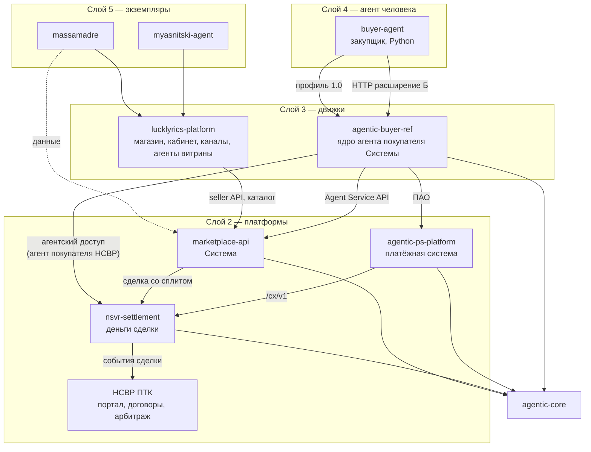

# Карта проектов: функции, пересечения, модульная структура

Редакция 3 · 08.10.2026. Периметр: massamadre, lucklyrics-platform, marketplace-api, buyer-agent, agentic-buyer-ref, agentic-ps-platform, агент покупателя НСВР, myasnitski-agent и связанные с ними agentic-core, nsvr-settlement, НСВР ПТК. Интерактивная версия — `projects-function-map.html`.

**Принцип разбора — без зауживания.** Ни одна функция, которая есть или запланирована хотя бы в одном проекте, не удаляется. Пересечение решается назначением одного владельца; остальные проекты получают функцию через контракт. Если функция сейчас живёт не у владельца — она переносится, а не теряется.

Обозначения: **владелец** — единственное место реализации; **потребитель** — пользуется через контракт; **переносится** — есть сейчас, но целевой владелец другой. Происхождение данных: «есть» — сверено с кодом на GitHub или по аудиту кода; «в документах» — описано в ТЗ и решениях; «план», «демо» — по материалам проекта.

## 1. Проекты: место и роль

| Проект | Репозиторий | Слой | Роль | На чём основано |
|---|---|---|---|---|
| **massamadre** | `kuzin4u/Sourdough-Bakery` | 5 | Экземпляр: пекарня Масса Мадре — бренд, ассортимент, контент, данные в Google Sheets, каналы. Сейчас содержит собственный движок (сайт, кабинет из 9 страниц, Telegram- и VK-боты, Apps Script). | GitHub: website/ (каталог, карточки, корзина, кабинет: заказы, товары, цены, остатки, промо, воронка, отзывы, аналитика), telegram-bot-python (main.py, Apps Script), vk-bot |
| **myasnitski-agent** | `kuzin4u/meat_agent` | 5 | Экземпляр: агенты для Мясницкого ряда. Сейчас — статические демо: агент витрины, колбасный агент, агент маркетплейса, мини-приложение MAX, интеграция, сравнение с конкурентом, письма клиенту. | GitHub: demo/ — myasnitsky-agent, kolbasa-agent-demo, mp-agent, max-miniapp, integration, uf-compare, iphone, письма |
| **buyer-agent** | `kuzin4u/buyer_agent` | 4 | Агент-закупщик (ядро А) на Python: знание о покупках человека по чекам ФНС, 8 функций, веб и бот, умный слой с моделью, экспорт профиля 1.0 — мост к агенту покупателя Системы. | GitHub: SPEC.md, agent/ (adapters/receipts_fns, profile, matching, core, export), web/, bot/, 471 тест |
| **lucklyrics-platform** | `kuzin4u/lucklyrics-platform (закрыт)` | 3 | Движок white-label: многоканальный магазин (бот, сайт, кабинет в формате Ozon/WB, воронки, оплата, аналитика), встроенный агент витрины, клиентские экземпляры (У Нас Вкус). | Нет доступа коннектора (404) — по документам проекта |
| **agentic-buyer-ref** | `нет репозитория (комплект готов)` | 3 | Ядро исполнения агента покупателя Системы: стадии сделки, политика, мандаты, пакет оплаты, события, отказы; порты профиля и советчика; набор соответствия из 30 сценариев. | Комплект: SPEC, Р1–Р18 |
| **marketplace-api** | `kuzin4u/marketplace-api (закрыт)` | 2 | Система «Распределённый маркетплейс»: участники, магазины, SKU, каталог Системы и рынка, ранжирование, корзина, заказы, конфигуратор каналов, расчёт сплита, тарифы, авторизация продавца, покупатели, агентный слой ст. 14–21. | Нет доступа коннектора — по аудиту server.js 23.08.2026 и пулу Системы |
| **nsvr-settlement** | `нет репозитория (комплект готов)` | 2 | Расчётный контур НСВР: деньги сделки, эскроу через BankAdapter, раскрытие и возврат, каналы внесения, сверка, поставщик условного исполнения. | Комплект: SPEC, BANK-ADAPTER, Н1–Н8 |
| **agentic-ps-platform** | `нет репозитория (комплект готов)` | 2 | Агентная платформа платёжной системы: реестр агентов, журнал согласий, бюджет мандата, точка решения в авторизации, агентские реквизиты, подтверждение, споры о полномочиях, ПАО, условное исполнение. | Комплект: SPEC, ПИ-1–ПИ-9, ПАО v1.1, РП1–РП15 |
| **агент покупателя НСВР** | `— (адаптер)` | — | Работа агента покупателя со сделками НСВР: черновик сделки, инструкции на внесение, состояние, документы, претензия; оплата на эскроу по условному мандату. Не отдельный модуль — адаптер ядра (Р17). | Решение Р17 |
| **agentic-core** | `нет репозитория (код v0.1.0)` | 1 | Общий пакет механизмов: канонизация, журнал с хэш-цепочкой, удержания, идемпотентность, подпись, события, деньги. | Код и 11 тестов |
| **НСВР ПТК (портал)** | `модули ПТК 01–08 (документы)` | 2 | Продукт НСВР для людей: Deal Engine, конструктор договоров и ЭДО, ЕСИА/КЭП/KYC, уведомления, виджет, админ-панель, веб-приложение и арбитраж. | Документы ПТК (файлы 01–08, 26) |

Слои: 1 — общий пакет; 2 — платформы (коммерция, расчёты, платёжная система, портал НСВР); 3 — движки (магазин и агенты витрины; ядро агента покупателя); 4 — продукт-агент человека; 5 — экземпляры клиентов. Зависимости — только вниз; модули одного слоя связаны только через API.

## 2. Перечень функций по проектам

### massamadre

Функции сейчас:

| Функция | Состояние | Целевой владелец | Что с ней происходит |
|---|---|---|---|
| ID1 Вход продавца и сессия | есть | marketplace-api | переносится к marketplace-api, здесь — потребитель через «API авторизации marketplace-api (JWT)» |
| ID2 Регистрация покупателя | есть | marketplace-api | переносится к marketplace-api, здесь — потребитель через «customers API» |
| ID6 Админ-панель | есть | marketplace-api | переносится к marketplace-api, здесь — потребитель через «admin API Системы» |
| CAT1 Товары и SKU | есть | marketplace-api | переносится к marketplace-api, здесь — потребитель через «seller products API» |
| CAT2 Витрина магазина | есть | lucklyrics-platform | переносится к lucklyrics-platform, здесь — потребитель через «движок витрины lucklyrics + данные из API» |
| CAT6 Коннектор внешнего магазина | есть | marketplace-api | переносится к marketplace-api, здесь — потребитель через «external shop connector» |
| CAT8 Отзывы | есть | lucklyrics-platform | переносится к lucklyrics-platform, здесь — потребитель через «модуль отзывов движка» |
| CAT9 Расписание выпечки и наличие | есть | lucklyrics-platform | переносится к lucklyrics-platform, здесь — потребитель через «модуль «производство под заказ»» |
| ORD1 Корзина и резерв стока | есть | marketplace-api | переносится к marketplace-api, здесь — потребитель через «cart API» |
| ORD2 Оформление заказа | есть | marketplace-api | переносится к marketplace-api, здесь — потребитель через «orders API» |
| ORD3 Кабинет продавца | есть | lucklyrics-platform | переносится к lucklyrics-platform, здесь — потребитель через «кабинет движка + seller API» |
| ORD4 Приём заказов из двух потоков | план | lucklyrics-platform | переносится к lucklyrics-platform, здесь — потребитель через «orders API (NETWORK)» |
| CH1 Telegram-бот магазина | есть | lucklyrics-platform | переносится к lucklyrics-platform, здесь — потребитель через «модуль канала Telegram» |
| CH2 VK-бот | есть | lucklyrics-platform | переносится к lucklyrics-platform, здесь — потребитель через «модуль канала VK» |
| CH3 MAX бот и мини-приложение | план | lucklyrics-platform | переносится к lucklyrics-platform, здесь — потребитель через «модуль канала MAX» |
| CH4 Воронка Reels и taplink | есть | lucklyrics-platform | переносится к lucklyrics-platform, здесь — потребитель через «модуль воронок» |
| CH5 Рассылки и напоминания | есть | lucklyrics-platform | переносится к lucklyrics-platform, здесь — потребитель через «модуль рассылок» |
| AN1 Аналитика продавца | есть | lucklyrics-platform | переносится к lucklyrics-platform, здесь — потребитель через «модуль аналитики движка» |
| AG1 Агент витрины (консультант продавца) | есть | lucklyrics-platform | переносится к lucklyrics-platform, здесь — потребитель через «движок агентов витрины, схема знаний» |
| AG3 Диалог и умный слой с моделью | есть | разделено (см. решение) | разделяется по решению |
| PAY1 Прямой приём оплаты продавцом | есть | lucklyrics-platform | переносится к lucklyrics-platform, здесь — потребитель через «платёжный модуль движка» |
| PAY5 Кассовый чек | есть | lucklyrics-platform | переносится к lucklyrics-platform, здесь — потребитель через «фискальный модуль движка» |
| LOG3 Fulfilment и доставка | есть | marketplace-api | переносится к marketplace-api, здесь — потребитель через «fulfilment rules» |
| INF3 Источник данных магазина | есть | lucklyrics-platform | переносится к lucklyrics-platform, здесь — потребитель через «адаптер источника в движке» |

Потребляет через контракты: ID1 Вход продавца и сессия (от marketplace-api); ID2 Регистрация покупателя (от marketplace-api); CAT1 Товары и SKU (от marketplace-api); CAT2 Витрина магазина (от lucklyrics-platform); CAT6 Коннектор внешнего магазина (от marketplace-api); CAT8 Отзывы (от lucklyrics-platform); CAT9 Расписание выпечки и наличие (от lucklyrics-platform); ORD1 Корзина и резерв стока (от marketplace-api); ORD2 Оформление заказа (от marketplace-api); ORD3 Кабинет продавца (от lucklyrics-platform); ORD4 Приём заказов из двух потоков (от lucklyrics-platform); CH1 Telegram-бот магазина (от lucklyrics-platform); CH2 VK-бот (от lucklyrics-platform); CH3 MAX бот и мини-приложение (от lucklyrics-platform); CH4 Воронка Reels и taplink (от lucklyrics-platform); CH5 Рассылки и напоминания (от lucklyrics-platform); AN1 Аналитика продавца (от lucklyrics-platform); AG1 Агент витрины (консультант продавца) (от lucklyrics-platform); PAY1 Прямой приём оплаты продавцом (от lucklyrics-platform); PAY5 Кассовый чек (от lucklyrics-platform); LOG3 Fulfilment и доставка (от marketplace-api); INF3 Источник данных магазина (от lucklyrics-platform).

### myasnitski-agent

Функции сейчас:

| Функция | Состояние | Целевой владелец | Что с ней происходит |
|---|---|---|---|
| CAT2 Витрина магазина | демо | lucklyrics-platform | переносится к lucklyrics-platform, здесь — потребитель через «движок витрины lucklyrics + данные из API» |
| CAT7 Каталог рынка | демо | marketplace-api | переносится к marketplace-api, здесь — потребитель через «market catalog API» |
| CH3 MAX бот и мини-приложение | демо | lucklyrics-platform | переносится к lucklyrics-platform, здесь — потребитель через «модуль канала MAX» |
| AN3 Аналитика каталога Ozon/WB для селлеров | демо | lucklyrics-platform | переносится к lucklyrics-platform, здесь — потребитель через «модуль аналитики МП» |
| AG1 Агент витрины (консультант продавца) | демо | lucklyrics-platform | переносится к lucklyrics-platform, здесь — потребитель через «движок агентов витрины, схема знаний» |
| AG3 Диалог и умный слой с моделью | демо | разделено (см. решение) | разделяется по решению |

Потребляет через контракты: CAT1 Товары и SKU (от marketplace-api); CAT2 Витрина магазина (от lucklyrics-platform); CAT7 Каталог рынка (от marketplace-api); ORD3 Кабинет продавца (от lucklyrics-platform); CH1 Telegram-бот магазина (от lucklyrics-platform); CH3 MAX бот и мини-приложение (от lucklyrics-platform); AN1 Аналитика продавца (от lucklyrics-platform); AN3 Аналитика каталога Ozon/WB для селлеров (от lucklyrics-platform); AG1 Агент витрины (консультант продавца) (от lucklyrics-platform); PAY1 Прямой приём оплаты продавцом (от lucklyrics-platform).

### buyer-agent

Функции сейчас:

| Функция | Состояние | Целевой владелец | Что с ней происходит |
|---|---|---|---|
| CAT4 Ранжирование выдачи | есть | marketplace-api | переносится к marketplace-api, здесь — потребитель через «catalog API» |
| CH5 Рассылки и напоминания | план | lucklyrics-platform | переносится к lucklyrics-platform, здесь — потребитель через «модуль рассылок» |
| CH6 Бот закупщика | есть | buyer-agent | остаётся здесь |
| AN2 Аналитика покупок человека | есть | buyer-agent | остаётся здесь |
| AG3 Диалог и умный слой с моделью | есть | разделено (см. решение) | разделяется по решению |
| AG4 Профиль человека | есть | buyer-agent | остаётся здесь |
| AG5 Персональный подбор | есть | buyer-agent | остаётся здесь |

Потребляет через контракты: CAT3 Каталог Системы и поиск (от marketplace-api); CAT4 Ранжирование выдачи (от marketplace-api); CAT7 Каталог рынка (от marketplace-api); AG2 Агент покупателя Системы (исполнение) (от agentic-buyer-ref); AG7 Агент сделок НСВР (от agentic-buyer-ref).

### lucklyrics-platform

Функции сейчас:

| Функция | Состояние | Целевой владелец | Что с ней происходит |
|---|---|---|---|
| ID1 Вход продавца и сессия | есть | marketplace-api | переносится к marketplace-api, здесь — потребитель через «API авторизации marketplace-api (JWT)» |
| ID2 Регистрация покупателя | есть | marketplace-api | переносится к marketplace-api, здесь — потребитель через «customers API» |
| CAT1 Товары и SKU | есть | marketplace-api | переносится к marketplace-api, здесь — потребитель через «seller products API» |
| CAT2 Витрина магазина | есть | lucklyrics-platform | остаётся здесь |
| CAT8 Отзывы | есть | lucklyrics-platform | остаётся здесь |
| CAT10 Машиночитаемая витрина для агентов | план | lucklyrics-platform | остаётся здесь |
| ORD1 Корзина и резерв стока | есть | marketplace-api | переносится к marketplace-api, здесь — потребитель через «cart API» |
| ORD2 Оформление заказа | есть | marketplace-api | переносится к marketplace-api, здесь — потребитель через «orders API» |
| ORD3 Кабинет продавца | есть | lucklyrics-platform | остаётся здесь |
| ORD4 Приём заказов из двух потоков | план | lucklyrics-platform | остаётся здесь |
| CH1 Telegram-бот магазина | есть | lucklyrics-platform | остаётся здесь |
| CH2 VK-бот | план | lucklyrics-platform | остаётся здесь |
| CH3 MAX бот и мини-приложение | план | lucklyrics-platform | остаётся здесь |
| CH4 Воронка Reels и taplink | есть | lucklyrics-platform | остаётся здесь |
| CH5 Рассылки и напоминания | есть | lucklyrics-platform | остаётся здесь |
| AN1 Аналитика продавца | есть | lucklyrics-platform | остаётся здесь |
| AN3 Аналитика каталога Ozon/WB для селлеров | есть | lucklyrics-platform | остаётся здесь |
| AG1 Агент витрины (консультант продавца) | есть | lucklyrics-platform | остаётся здесь |
| AG3 Диалог и умный слой с моделью | есть | разделено (см. решение) | разделяется по решению |
| PAY1 Прямой приём оплаты продавцом | есть | lucklyrics-platform | остаётся здесь |
| PAY5 Кассовый чек | есть | lucklyrics-platform | остаётся здесь |
| LOG2 Онбординг продавца | есть | marketplace-api | переносится к marketplace-api, здесь — потребитель через «onboarding API» |
| INF3 Источник данных магазина | есть | lucklyrics-platform | остаётся здесь |

Принимает во владение: CAT9 Расписание выпечки и наличие.

Потребляет через контракты: ID1 Вход продавца и сессия (от marketplace-api); ID2 Регистрация покупателя (от marketplace-api); ID4 Реестр агентов и ключи (от agentic-ps-platform); CAT1 Товары и SKU (от marketplace-api); CAT3 Каталог Системы и поиск (от marketplace-api); CAT5 Конфигуратор каналов и видимость (от marketplace-api); CAT6 Коннектор внешнего магазина (от marketplace-api); ORD1 Корзина и резерв стока (от marketplace-api); ORD2 Оформление заказа (от marketplace-api); LOG1 Реестр участников Системы (от marketplace-api); LOG2 Онбординг продавца (от marketplace-api); LOG3 Fulfilment и доставка (от marketplace-api); NORM1 Правила Системы ред. 3 (от marketplace-api).

### agentic-buyer-ref

Функции сейчас:

| Функция | Состояние | Целевой владелец | Что с ней происходит |
|---|---|---|---|
| ID4 Реестр агентов и ключи | в документах | agentic-ps-platform | переносится к agentic-ps-platform, здесь — потребитель через «ПАО / participants API» |
| ID5 Подпись и проверка запросов | в документах | agentic-core | переносится к agentic-core, здесь — потребитель через «agentic-core signing» |
| CAT4 Ранжирование выдачи | в документах | marketplace-api | переносится к marketplace-api, здесь — потребитель через «catalog API» |
| AG2 Агент покупателя Системы (исполнение) | в документах | agentic-buyer-ref | остаётся здесь |
| AG4 Профиль человека | в документах | buyer-agent | переносится к buyer-agent, здесь — потребитель через «экспорт профиля 1.0» |
| AG5 Персональный подбор | в документах | buyer-agent | переносится к buyer-agent, здесь — потребитель через «экспорт / HTTP» |
| MND1 Мандаты и журнал согласий | в документах | agentic-ps-platform | переносится к agentic-ps-platform, здесь — потребитель через «ПАО, MandateStore» |
| INF1 Журнал, удержания, идемпотентность, события, деньги | в документах | agentic-core | переносится к agentic-core, здесь — потребитель через «agentic-core» |
| INF2 Эмуляторы и испытания | в документах | разделено (см. решение) | разделяется по решению |

Принимает во владение: AG7 Агент сделок НСВР.

Потребляет через контракты: ID4 Реестр агентов и ключи (от agentic-ps-platform); ID5 Подпись и проверка запросов (от agentic-core); CAT3 Каталог Системы и поиск (от marketplace-api); CAT4 Ранжирование выдачи (от marketplace-api); CAT7 Каталог рынка (от marketplace-api); CAT10 Машиночитаемая витрина для агентов (от lucklyrics-platform); ORD2 Оформление заказа (от marketplace-api); AN2 Аналитика покупок человека (от buyer-agent); AG4 Профиль человека (от buyer-agent); AG5 Персональный подбор (от buyer-agent); AG6 Agent Service API (от marketplace-api); MND1 Мандаты и журнал согласий (от agentic-ps-platform); MND2 Ограничения и бюджет мандата (от agentic-ps-platform); MND4 Признак агентной операции (от agentic-ps-platform); PAY2 Агентские реквизиты и авторизация (от agentic-ps-platform); INF1 Журнал, удержания, идемпотентность, события, деньги (от agentic-core); NORM1 Правила Системы ред. 3 (от marketplace-api); NORM2 Нормы A1–A9 и ПАО (от agentic-ps-platform).

### marketplace-api

Функции сейчас:

| Функция | Состояние | Целевой владелец | Что с ней происходит |
|---|---|---|---|
| ID1 Вход продавца и сессия | есть | marketplace-api | остаётся здесь |
| ID2 Регистрация покупателя | есть | marketplace-api | остаётся здесь |
| ID4 Реестр агентов и ключи | есть | agentic-ps-platform | переносится к agentic-ps-platform, здесь — потребитель через «ПАО / participants API» |
| ID5 Подпись и проверка запросов | есть | agentic-core | переносится к agentic-core, здесь — потребитель через «agentic-core signing» |
| ID6 Админ-панель | есть | marketplace-api | остаётся здесь |
| CAT1 Товары и SKU | есть | marketplace-api | остаётся здесь |
| CAT2 Витрина магазина | есть | lucklyrics-platform | переносится к lucklyrics-platform, здесь — потребитель через «движок витрины lucklyrics + данные из API» |
| CAT3 Каталог Системы и поиск | есть | marketplace-api | остаётся здесь |
| CAT4 Ранжирование выдачи | есть | marketplace-api | остаётся здесь |
| CAT5 Конфигуратор каналов и видимость | есть | marketplace-api | остаётся здесь |
| CAT6 Коннектор внешнего магазина | в документах | marketplace-api | остаётся здесь |
| CAT7 Каталог рынка | есть | marketplace-api | остаётся здесь |
| CAT10 Машиночитаемая витрина для агентов | есть | lucklyrics-platform | переносится к lucklyrics-platform, здесь — потребитель через «разметка витрины + Agent Service API» |
| ORD1 Корзина и резерв стока | есть | marketplace-api | остаётся здесь |
| ORD2 Оформление заказа | есть | marketplace-api | остаётся здесь |
| ORD3 Кабинет продавца | есть | lucklyrics-platform | переносится к lucklyrics-platform, здесь — потребитель через «кабинет движка + seller API» |
| ORD4 Приём заказов из двух потоков | есть | lucklyrics-platform | переносится к lucklyrics-platform, здесь — потребитель через «orders API (NETWORK)» |
| AN4 BI Системы | есть | marketplace-api | остаётся здесь |
| AG2 Агент покупателя Системы (исполнение) | есть | agentic-buyer-ref | переносится к agentic-buyer-ref, здесь — потребитель через «HTTP ядра, ПАО, Agent Service API» |
| AG3 Диалог и умный слой с моделью | есть | разделено (см. решение) | разделяется по решению |
| AG6 Agent Service API | есть | marketplace-api | остаётся здесь |
| MND1 Мандаты и журнал согласий | есть | agentic-ps-platform | переносится к agentic-ps-platform, здесь — потребитель через «ПАО, MandateStore» |
| PAY3 Приём через Систему: карта, СБП | план | nsvr-settlement | переносится к nsvr-settlement, здесь — потребитель через «каналы внесения nsvr, /cx/v1» |
| PAY5 Кассовый чек | в документах | lucklyrics-platform | переносится к lucklyrics-platform, здесь — потребитель через «фискальный модуль движка» |
| SET1 Расчёт сплита и тарифов | есть | marketplace-api | остаётся здесь |
| SET2 Эскроу: удержание, раскрытие, возврат | план | nsvr-settlement | переносится к nsvr-settlement, здесь — потребитель через «BankAdapter, bank-adapter.yaml» |
| SET3 Выплаты участникам | план | nsvr-settlement | переносится к nsvr-settlement, здесь — потребитель через «commit со сплитом» |
| DEAL3 Споры о полномочиях | в документах | agentic-ps-platform | переносится к agentic-ps-platform, здесь — потребитель через «П7, ст. 21» |
| DEAL4 Споры о качестве и исполнении | в документах | НСВР ПТК (портал) | переносится к НСВР ПТК (портал), здесь — потребитель через «Arbitrage Service, route=PROVIDER» |
| LOG1 Реестр участников Системы | есть | marketplace-api | остаётся здесь |
| LOG2 Онбординг продавца | есть | marketplace-api | остаётся здесь |
| LOG3 Fulfilment и доставка | есть | marketplace-api | остаётся здесь |
| INF1 Журнал, удержания, идемпотентность, события, деньги | есть | agentic-core | переносится к agentic-core, здесь — потребитель через «agentic-core» |
| INF3 Источник данных магазина | есть | lucklyrics-platform | переносится к lucklyrics-platform, здесь — потребитель через «адаптер источника в движке» |
| NORM1 Правила Системы ред. 3 | в документах | marketplace-api | остаётся здесь |

Потребляет через контракты: ID3 ЕСИА, КЭП, KYC (от НСВР ПТК (портал)); ID4 Реестр агентов и ключи (от agentic-ps-platform); ID5 Подпись и проверка запросов (от agentic-core); CAT2 Витрина магазина (от lucklyrics-platform); CAT8 Отзывы (от lucklyrics-platform); CAT10 Машиночитаемая витрина для агентов (от lucklyrics-platform); ORD3 Кабинет продавца (от lucklyrics-platform); AG2 Агент покупателя Системы (исполнение) (от agentic-buyer-ref); MND1 Мандаты и журнал согласий (от agentic-ps-platform); MND4 Признак агентной операции (от agentic-ps-platform); PAY3 Приём через Систему: карта, СБП (от nsvr-settlement); PAY5 Кассовый чек (от lucklyrics-platform); SET2 Эскроу: удержание, раскрытие, возврат (от nsvr-settlement); SET3 Выплаты участникам (от nsvr-settlement); DEAL2 Договор и закрывающие документы (от НСВР ПТК (портал)); DEAL3 Споры о полномочиях (от agentic-ps-platform); DEAL4 Споры о качестве и исполнении (от НСВР ПТК (портал)); INF1 Журнал, удержания, идемпотентность, события, деньги (от agentic-core); NORM2 Нормы A1–A9 и ПАО (от agentic-ps-platform).

### nsvr-settlement

Функции сейчас:

| Функция | Состояние | Целевой владелец | Что с ней происходит |
|---|---|---|---|
| ID5 Подпись и проверка запросов | в документах | agentic-core | переносится к agentic-core, здесь — потребитель через «agentic-core signing» |
| MND3 Подтверждение человеком | в документах | разделено (см. решение) | разделяется по решению |
| PAY3 Приём через Систему: карта, СБП | в документах | nsvr-settlement | остаётся здесь |
| PAY4 Приём наличных | в документах | nsvr-settlement | остаётся здесь |
| SET2 Эскроу: удержание, раскрытие, возврат | в документах | nsvr-settlement | остаётся здесь |
| SET3 Выплаты участникам | в документах | nsvr-settlement | остаётся здесь |
| SET4 Сверка с банком | в документах | nsvr-settlement | остаётся здесь |
| SET5 Условное исполнение | в документах | agentic-ps-platform | переносится к agentic-ps-platform, здесь — потребитель через «/cx/v1» |
| DEAL1 Deal Engine (состояния сделки) | в документах | НСВР ПТК (портал) | переносится к НСВР ПТК (портал), здесь — потребитель через «события сделки» |
| DEAL4 Споры о качестве и исполнении | в документах | НСВР ПТК (портал) | переносится к НСВР ПТК (портал), здесь — потребитель через «Arbitrage Service, route=PROVIDER» |
| INF1 Журнал, удержания, идемпотентность, события, деньги | в документах | agentic-core | переносится к agentic-core, здесь — потребитель через «agentic-core» |
| INF2 Эмуляторы и испытания | в документах | разделено (см. решение) | разделяется по решению |

Потребляет через контракты: ID3 ЕСИА, КЭП, KYC (от НСВР ПТК (портал)); ID4 Реестр агентов и ключи (от agentic-ps-platform); ID5 Подпись и проверка запросов (от agentic-core); MND1 Мандаты и журнал согласий (от agentic-ps-platform); MND4 Признак агентной операции (от agentic-ps-platform); SET1 Расчёт сплита и тарифов (от marketplace-api); SET5 Условное исполнение (от agentic-ps-platform); DEAL1 Deal Engine (состояния сделки) (от НСВР ПТК (портал)); DEAL2 Договор и закрывающие документы (от НСВР ПТК (портал)); DEAL3 Споры о полномочиях (от agentic-ps-platform); DEAL4 Споры о качестве и исполнении (от НСВР ПТК (портал)); LOG1 Реестр участников Системы (от marketplace-api); INF1 Журнал, удержания, идемпотентность, события, деньги (от agentic-core); NORM1 Правила Системы ред. 3 (от marketplace-api); NORM2 Нормы A1–A9 и ПАО (от agentic-ps-platform).

### agentic-ps-platform

Функции сейчас:

| Функция | Состояние | Целевой владелец | Что с ней происходит |
|---|---|---|---|
| ID3 ЕСИА, КЭП, KYC | в документах | НСВР ПТК (портал) | переносится к НСВР ПТК (портал), здесь — потребитель через «Auth Service ПТК» |
| ID4 Реестр агентов и ключи | в документах | agentic-ps-platform | остаётся здесь |
| ID5 Подпись и проверка запросов | в документах | agentic-core | переносится к agentic-core, здесь — потребитель через «agentic-core signing» |
| CAT10 Машиночитаемая витрина для агентов | в документах | lucklyrics-platform | переносится к lucklyrics-platform, здесь — потребитель через «разметка витрины + Agent Service API» |
| MND1 Мандаты и журнал согласий | в документах | agentic-ps-platform | остаётся здесь |
| MND2 Ограничения и бюджет мандата | в документах | agentic-ps-platform | остаётся здесь |
| MND3 Подтверждение человеком | в документах | разделено (см. решение) | разделяется по решению |
| MND4 Признак агентной операции | в документах | agentic-ps-platform | остаётся здесь |
| PAY2 Агентские реквизиты и авторизация | в документах | agentic-ps-platform | остаётся здесь |
| PAY3 Приём через Систему: карта, СБП | в документах | nsvr-settlement | переносится к nsvr-settlement, здесь — потребитель через «каналы внесения nsvr, /cx/v1» |
| SET5 Условное исполнение | в документах | agentic-ps-platform | остаётся здесь |
| DEAL3 Споры о полномочиях | в документах | agentic-ps-platform | остаётся здесь |
| INF1 Журнал, удержания, идемпотентность, события, деньги | в документах | agentic-core | переносится к agentic-core, здесь — потребитель через «agentic-core» |
| INF2 Эмуляторы и испытания | в документах | разделено (см. решение) | разделяется по решению |
| NORM2 Нормы A1–A9 и ПАО | в документах | agentic-ps-platform | остаётся здесь |

Потребляет через контракты: ID3 ЕСИА, КЭП, KYC (от НСВР ПТК (портал)); ID5 Подпись и проверка запросов (от agentic-core); CAT10 Машиночитаемая витрина для агентов (от lucklyrics-platform); PAY3 Приём через Систему: карта, СБП (от nsvr-settlement); SET2 Эскроу: удержание, раскрытие, возврат (от nsvr-settlement); DEAL4 Споры о качестве и исполнении (от НСВР ПТК (портал)); INF1 Журнал, удержания, идемпотентность, события, деньги (от agentic-core).

### агент покупателя НСВР

Функции сейчас:

| Функция | Состояние | Целевой владелец | Что с ней происходит |
|---|---|---|---|
| AG7 Агент сделок НСВР | план | agentic-buyer-ref | переносится к agentic-buyer-ref, здесь — потребитель через «агентский доступ nsvr» |

### agentic-core

Функции сейчас:

| Функция | Состояние | Целевой владелец | Что с ней происходит |
|---|---|---|---|
| INF1 Журнал, удержания, идемпотентность, события, деньги | есть | agentic-core | остаётся здесь |

Принимает во владение: ID5 Подпись и проверка запросов.

### НСВР ПТК (портал)

Функции сейчас:

| Функция | Состояние | Целевой владелец | Что с ней происходит |
|---|---|---|---|
| ID3 ЕСИА, КЭП, KYC | в документах | НСВР ПТК (портал) | остаётся здесь |
| ID6 Админ-панель | в документах | marketplace-api | переносится к marketplace-api, здесь — потребитель через «admin API Системы» |
| AN4 BI Системы | в документах | marketplace-api | переносится к marketplace-api, здесь — потребитель через «admin/BI API» |
| MND3 Подтверждение человеком | в документах | разделено (см. решение) | разделяется по решению |
| SET1 Расчёт сплита и тарифов | в документах | marketplace-api | переносится к marketplace-api, здесь — потребитель через «settlement rules» |
| SET2 Эскроу: удержание, раскрытие, возврат | в документах | nsvr-settlement | переносится к nsvr-settlement, здесь — потребитель через «BankAdapter, bank-adapter.yaml» |
| DEAL1 Deal Engine (состояния сделки) | в документах | НСВР ПТК (портал) | остаётся здесь |
| DEAL2 Договор и закрывающие документы | в документах | НСВР ПТК (портал) | остаётся здесь |
| DEAL4 Споры о качестве и исполнении | в документах | НСВР ПТК (портал) | остаётся здесь |

Потребляет через контракты: ID6 Админ-панель (от marketplace-api); AN4 BI Системы (от marketplace-api); SET2 Эскроу: удержание, раскрытие, возврат (от nsvr-settlement).

## 3. Матрица: функция × проект (целевое состояние)

| Функция | Домен | massamadre | myasnitski-agent | buyer-agent | lucklyrics-platform | agentic-buyer-ref | marketplace-api | nsvr-settlement | agentic-ps-platform | агент покупателя НСВР | agentic-core | НСВР ПТК (портал) |
|---|---|---|---|---|---|---|---|---|---|---|---|---|
| ID1 Вход продавца и сессия | Идентичность и доступ | ○ |  |  | ○ |  | **●** |  |  |  |  |  |
| ID2 Регистрация покупателя | Идентичность и доступ | ○ |  |  | ○ |  | **●** |  |  |  |  |  |
| ID3 ЕСИА, КЭП, KYC | Идентичность и доступ |  |  |  |  |  | ○ | ○ | ○ |  |  | **●** |
| ID4 Реестр агентов и ключи | Идентичность и доступ |  |  |  | ○ | ○ | ○ | ○ | **●** |  |  |  |
| ID5 Подпись и проверка запросов | Идентичность и доступ |  |  |  |  | ○ | ○ | ○ | ○ |  | **●** |  |
| ID6 Админ-панель | Идентичность и доступ | → |  |  |  |  | **●** |  |  |  |  | ○ |
| CAT1 Товары и SKU | Каталог и витрина | ○ | ○ |  | ○ |  | **●** |  |  |  |  |  |
| CAT2 Витрина магазина | Каталог и витрина | ○ | ○ |  | **●** |  | ○ |  |  |  |  |  |
| CAT3 Каталог Системы и поиск | Каталог и витрина |  |  | ○ | ○ | ○ | **●** |  |  |  |  |  |
| CAT4 Ранжирование выдачи | Каталог и витрина |  |  | ○ |  | ○ | **●** |  |  |  |  |  |
| CAT5 Конфигуратор каналов и видимость | Каталог и витрина |  |  |  | ○ |  | **●** |  |  |  |  |  |
| CAT6 Коннектор внешнего магазина | Каталог и витрина | ○ |  |  | ○ |  | **●** |  |  |  |  |  |
| CAT7 Каталог рынка | Каталог и витрина |  | ○ | ○ |  | ○ | **●** |  |  |  |  |  |
| CAT8 Отзывы | Каталог и витрина | ○ |  |  | **●** |  | ○ |  |  |  |  |  |
| CAT9 Расписание выпечки и наличие | Каталог и витрина | ○ |  |  | **●** |  |  |  |  |  |  |  |
| CAT10 Машиночитаемая витрина для агентов | Каталог и витрина |  |  |  | **●** | ○ | ○ |  | ○ |  |  |  |
| ORD1 Корзина и резерв стока | Заказ и кабинет | ○ |  |  | ○ |  | **●** |  |  |  |  |  |
| ORD2 Оформление заказа | Заказ и кабинет | ○ |  |  | ○ | ○ | **●** |  |  |  |  |  |
| ORD3 Кабинет продавца | Заказ и кабинет | ○ | ○ |  | **●** |  | ○ |  |  |  |  |  |
| ORD4 Приём заказов из двух потоков | Заказ и кабинет | ○ |  |  | **●** |  | → |  |  |  |  |  |
| CH1 Telegram-бот магазина | Каналы и коммуникации | ○ | ○ |  | **●** |  |  |  |  |  |  |  |
| CH2 VK-бот | Каналы и коммуникации | ○ |  |  | **●** |  |  |  |  |  |  |  |
| CH3 MAX бот и мини-приложение | Каналы и коммуникации | ○ | ○ |  | **●** |  |  |  |  |  |  |  |
| CH4 Воронка Reels и taplink | Каналы и коммуникации | ○ |  |  | **●** |  |  |  |  |  |  |  |
| CH5 Рассылки и напоминания | Каналы и коммуникации | ○ |  | → | **●** |  |  |  |  |  |  |  |
| CH6 Бот закупщика | Каналы и коммуникации |  |  | **●** |  |  |  |  |  |  |  |  |
| AN1 Аналитика продавца | Аналитика | ○ | ○ |  | **●** |  |  |  |  |  |  |  |
| AN2 Аналитика покупок человека | Аналитика |  |  | **●** |  | ○ |  |  |  |  |  |  |
| AN3 Аналитика каталога Ozon/WB для селлеров | Аналитика |  | ○ |  | **●** |  |  |  |  |  |  |  |
| AN4 BI Системы | Аналитика |  |  |  |  |  | **●** |  |  |  |  | ○ |
| AG1 Агент витрины (консультант продавца) | Агенты и модель | ○ | ○ |  | **●** |  |  |  |  |  |  |  |
| AG2 Агент покупателя Системы (исполнение) | Агенты и модель |  |  | ○ |  | **●** | ○ |  |  |  |  |  |
| AG3 Диалог и умный слой с моделью | Агенты и модель | → | → | → | → |  | → |  |  |  |  |  |
| AG4 Профиль человека | Агенты и модель |  |  | **●** |  | ○ |  |  |  |  |  |  |
| AG5 Персональный подбор | Агенты и модель |  |  | **●** |  | ○ |  |  |  |  |  |  |
| AG6 Agent Service API | Агенты и модель |  |  |  |  | ○ | **●** |  |  |  |  |  |
| AG7 Агент сделок НСВР | Агенты и модель |  |  | ○ |  | **●** |  |  |  | → |  |  |
| MND1 Мандаты и журнал согласий | Мандаты и полномочия |  |  |  |  | ○ | ○ | ○ | **●** |  |  |  |
| MND2 Ограничения и бюджет мандата | Мандаты и полномочия |  |  |  |  | ○ |  |  | **●** |  |  |  |
| MND3 Подтверждение человеком | Мандаты и полномочия |  |  |  |  |  |  | → | → |  |  | → |
| MND4 Признак агентной операции | Мандаты и полномочия |  |  |  |  | ○ | ○ | ○ | **●** |  |  |  |
| PAY1 Прямой приём оплаты продавцом | Платежи | ○ | ○ |  | **●** |  |  |  |  |  |  |  |
| PAY2 Агентские реквизиты и авторизация | Платежи |  |  |  |  | ○ |  |  | **●** |  |  |  |
| PAY3 Приём через Систему: карта, СБП | Платежи |  |  |  |  |  | ○ | **●** | ○ |  |  |  |
| PAY4 Приём наличных | Платежи |  |  |  |  |  |  | **●** |  |  |  |  |
| PAY5 Кассовый чек | Платежи | ○ |  |  | **●** |  | ○ |  |  |  |  |  |
| SET1 Расчёт сплита и тарифов | Расчёты и эскроу |  |  |  |  |  | **●** | ○ |  |  |  | → |
| SET2 Эскроу: удержание, раскрытие, возврат | Расчёты и эскроу |  |  |  |  |  | ○ | **●** | ○ |  |  | ○ |
| SET3 Выплаты участникам | Расчёты и эскроу |  |  |  |  |  | ○ | **●** |  |  |  |  |
| SET4 Сверка с банком | Расчёты и эскроу |  |  |  |  |  |  | **●** |  |  |  |  |
| SET5 Условное исполнение | Расчёты и эскроу |  |  |  |  |  |  | ○ | **●** |  |  |  |
| DEAL1 Deal Engine (состояния сделки) | Сделка и споры |  |  |  |  |  |  | ○ |  |  |  | **●** |
| DEAL2 Договор и закрывающие документы | Сделка и споры |  |  |  |  |  | ○ | ○ |  |  |  | **●** |
| DEAL3 Споры о полномочиях | Сделка и споры |  |  |  |  |  | ○ | ○ | **●** |  |  |  |
| DEAL4 Споры о качестве и исполнении | Сделка и споры |  |  |  |  |  | ○ | ○ | ○ |  |  | **●** |
| LOG1 Реестр участников Системы | Участники и логистика |  |  |  | ○ |  | **●** | ○ |  |  |  |  |
| LOG2 Онбординг продавца | Участники и логистика |  |  |  | ○ |  | **●** |  |  |  |  |  |
| LOG3 Fulfilment и доставка | Участники и логистика | ○ |  |  | ○ |  | **●** |  |  |  |  |  |
| INF1 Журнал, удержания, идемпотентность, события, деньги | Общие механизмы и испытания |  |  |  |  | ○ | ○ | ○ | ○ |  | **●** |  |
| INF2 Эмуляторы и испытания | Общие механизмы и испытания |  |  |  |  | → |  | → | → |  |  |  |
| INF3 Источник данных магазина | Общие механизмы и испытания | ○ |  |  | **●** |  | → |  |  |  |  |  |
| NORM1 Правила Системы ред. 3 | Нормы и контракты |  |  |  | ○ | ○ | **●** | ○ |  |  |  |  |
| NORM2 Нормы A1–A9 и ПАО | Нормы и контракты |  |  |  |  | ○ | ○ | ○ | **●** |  |  |  |

● владелец · ○ потребитель через контракт · → есть сейчас, переносится. Строки без ● — функции, разделённые между владельцами по решению (AG3, MND3, INF2).

## 4. Пересечения и их разрешение

**ID1. Вход продавца и сессия** — Регистрация и вход продавца, токен, проверка владения магазином.  
Где сейчас: marketplace-api (есть), massamadre (есть), lucklyrics-platform (есть).  
Владелец: marketplace-api. Контракт: API авторизации marketplace-api (JWT).  
Решение: Учётная запись продавца одна — в Системе. Кабинет lucklyrics-platform и massamadre входят через неё (OAuth-подобный вход). Пароль sourdough-admin выводится.

**ID2. Регистрация покупателя** — Карточка покупателя магазина и Системы.  
Где сейчас: marketplace-api (есть), massamadre (есть), lucklyrics-platform (есть).  
Владелец: marketplace-api. Контракт: customers API.  
Решение: Покупатель магазина и Системы — одна запись в marketplace-api с меткой источника (MIGRATED / NETWORK). Магазины хранят ссылку, а не копию.

**ID3. ЕСИА, КЭП, KYC** — Подтверждение личности, усиленная подпись, уровни KYC.  
Где сейчас: НСВР ПТК (портал) (в документах), agentic-ps-platform (в документах).  
Владелец: НСВР ПТК (портал). Контракт: Auth Service ПТК.  
Решение: Владелец — Auth ПТК. Подпись мандатов в платформе ПС идёт через банк (ПИ-8); подпись договоров сделки — через Auth ПТК. Это два разных акта, а не дубль.

**ID4. Реестр агентов и ключи** — Допуск агентов, коды, классы, уровни, ключи, отзыв.  
Где сейчас: agentic-ps-platform (в документах), marketplace-api (есть), agentic-buyer-ref (в документах).  
Владелец: agentic-ps-platform. Контракт: ПАО / participants API.  
Решение: Авторитет — платформа ПС. marketplace-api до её появления держит локальный реестр за интерфейсом AgentDirectory на agentic-core; мок в ядре — только для модульных тестов.

**ID5. Подпись и проверка запросов** — HTTP-подпись, окно времени, nonce, статус ключа.  
Где сейчас: agentic-ps-platform (в документах), marketplace-api (есть), agentic-buyer-ref (в документах), nsvr-settlement (в документах).  
Владелец: agentic-core. Контракт: agentic-core signing.  
Решение: Одна реализация в agentic-core; Python-проекты (buyer_agent) проверяются по тестовым векторам.

**ID6. Админ-панель** — Управление участниками, модерация, справочники.  
Где сейчас: massamadre (есть), marketplace-api (есть), НСВР ПТК (портал) (в документах).  
Владелец: marketplace-api. Контракт: admin API Системы.  
Решение: Админ Системы — marketplace-api (участники, модерация, тарифы) + модули BI ПТК. Админ магазина (расписание, товары) — кабинет движка lucklyrics. sourdough-admin.html разбирается между ними.

**CAT1. Товары и SKU** — Создание и правка товаров, фото, категории, видимость.  
Где сейчас: massamadre (есть), marketplace-api (есть), lucklyrics-platform (есть).  
Владелец: marketplace-api. Контракт: seller products API.  
Решение: Источник истины SKU для магазинов Системы — marketplace-api (ст. 9.4). Внешний магазин (massamadre, Sheets) остаётся источником для себя и зеркалится коннектором.

**CAT2. Витрина магазина** — Страница магазина, каталог, карточки, корзина.  
Где сейчас: massamadre (есть), marketplace-api (есть), lucklyrics-platform (есть), myasnitski-agent (демо).  
Владелец: lucklyrics-platform. Контракт: движок витрины lucklyrics + данные из API.  
Решение: Отрисовка любой витрины (Тип 1 и Тип 2) — движок lucklyrics-platform. marketplace-api отдаёт данные и перестаёт держать свою витрину (vitrina-live становится эталоном для движка).

**CAT4. Ранжирование выдачи** — Формула ст. 11: исполнение ≥ цены, без платного места.  
Где сейчас: marketplace-api (есть), buyer-agent (есть), agentic-buyer-ref (в документах).  
Владелец: marketplace-api. Контракт: catalog API.  
Решение: Нейтральная выдача — marketplace-api. Персональный подбор поверх выдачи — buyer_agent (профиль × каталог, горизонт). Ядро агента не ранжирует, только проверяет политику.

**CAT6. Коннектор внешнего магазина** — Зеркало каталога Sheets/сайта в каталог Системы.  
Где сейчас: marketplace-api (в документах), massamadre (есть).  
Владелец: marketplace-api. Контракт: external shop connector.  
Решение: Коннектор один — в marketplace-api; Apps Script massamadre становится его источником, а не отдельным API.

**CAT7. Каталог рынка** — Сведения о внешних продавцах без гарантий, парсинг.  
Где сейчас: marketplace-api (есть), myasnitski-agent (демо).  
Владелец: marketplace-api. Контракт: market catalog API.  
Решение: Сбор и хранение — marketplace-api (каталог ⚪). Сравнение с конкурентом (uf-compare) и подбор закупщика — потребители.

**CAT8. Отзывы** — Сбор и показ отзывов.  
Где сейчас: massamadre (есть), lucklyrics-platform (есть).  
Владелец: lucklyrics-platform. Контракт: модуль отзывов движка.  
Решение: Модуль движка; рейтинг для ранжирования передаётся в marketplace-api.

**CAT10. Машиночитаемая витрина для агентов** — JSON-LD, равное раскрытие, знак готовности.  
Где сейчас: lucklyrics-platform (план), marketplace-api (есть), agentic-ps-platform (в документах).  
Владелец: lucklyrics-platform. Контракт: разметка витрины + Agent Service API.  
Решение: Разметка на страницах — движок lucklyrics; API для агентов — marketplace-api; требования и знак готовности — нормы A5 (платформа ПС).

**ORD1. Корзина и резерв стока** — Добавление, резерв, мультипродавцовая корзина.  
Где сейчас: marketplace-api (есть), massamadre (есть), lucklyrics-platform (есть).  
Владелец: marketplace-api. Контракт: cart API.  
Решение: Корзина магазина Системы — marketplace-api. Внешний магазин может держать свою, но заказ в Систему идёт через API.

**ORD2. Оформление заказа** — Создание заказа, сумма считает сервер.  
Где сейчас: marketplace-api (есть), massamadre (есть), lucklyrics-platform (есть).  
Владелец: marketplace-api. Контракт: orders API.  
Решение: Заказ с расчётом через Систему — только marketplace-api. Прямой заказ магазина (ЮKassa) — движок lucklyrics с меткой entry_point=SHOP.

**ORD3. Кабинет продавца** — Заказы, товары, цены, остатки, промо, воронка, отзывы, аналитика.  
Где сейчас: massamadre (есть), marketplace-api (есть), lucklyrics-platform (есть).  
Владелец: lucklyrics-platform. Контракт: кабинет движка + seller API.  
Решение: Один кабинет в формате Ozon/WB — движок lucklyrics; данные Системы (каналы, NETWORK-заказы, клиринг) — из marketplace-api. 9 страниц cabinet-* massamadre переносятся в движок без потери функций.

**CH1. Telegram-бот магазина** — Заказ, подписка, промо, лояльность.  
Где сейчас: massamadre (есть), lucklyrics-platform (есть).  
Владелец: lucklyrics-platform. Контракт: модуль канала Telegram.  
Решение: Модуль движка; main.py massamadre — эталон для переноса.

**CH2. VK-бот** — Канал VK.  
Где сейчас: massamadre (есть), lucklyrics-platform (план).  
Владелец: lucklyrics-platform. Контракт: модуль канала VK.  
Решение: Модуль движка.

**CH3. MAX бот и мини-приложение** — Канал MAX.  
Где сейчас: massamadre (план), myasnitski-agent (демо), lucklyrics-platform (план).  
Владелец: lucklyrics-platform. Контракт: модуль канала MAX.  
Решение: Мини-приложение из meat_agent — прототип модуля движка, а не отдельный продукт.

**CH4. Воронка Reels и taplink** — Видео-воронка, taplink, микро-воронки по SKU.  
Где сейчас: massamadre (есть), lucklyrics-platform (есть).  
Владелец: lucklyrics-platform. Контракт: модуль воронок.  
Решение: Движок; контент — экземпляр.

**CH5. Рассылки и напоминания** — Брошенная корзина, перед выпечкой, повтор.  
Где сейчас: massamadre (есть), lucklyrics-platform (есть), buyer-agent (план).  
Владелец: lucklyrics-platform. Контракт: модуль рассылок.  
Решение: Рассылки магазина — движок. Напоминания закупщика (расширение Б) — у buyer_agent: другой принципал, не дубль.

**AN1. Аналитика продавца** — Продажи, воронка, цены, остатки.  
Где сейчас: massamadre (есть), lucklyrics-platform (есть).  
Владелец: lucklyrics-platform. Контракт: модуль аналитики движка.  
Решение: Движок; сейчас в cabinet-analytics massamadre.

**AN3. Аналитика каталога Ozon/WB для селлеров** — Разбор карточек и отзывов маркетплейсов.  
Где сейчас: lucklyrics-platform (есть), myasnitski-agent (демо).  
Владелец: lucklyrics-platform. Контракт: модуль аналитики МП.  
Решение: Агент маркетплейса (mp-agent) — роль этого модуля для клиента.

**AN4. BI Системы** — Сводные показатели Системы, клиринг, участники.  
Где сейчас: marketplace-api (есть), НСВР ПТК (портал) (в документах).  
Владелец: marketplace-api. Контракт: admin/BI API.  
Решение: Данные — marketplace-api; модули BI ПТК — витрина отчётов.

**AG1. Агент витрины (консультант продавца)** — Отвечает покупателю на витрине, знает ассортимент.  
Где сейчас: massamadre (есть), lucklyrics-platform (есть), myasnitski-agent (демо).  
Владелец: lucklyrics-platform. Контракт: движок агентов витрины, схема знаний.  
Решение: Один движок; ИИ-консультант бота massamadre, агенты Мясницкого и У Нас Вкус — экземпляры знаний. Класс SELLER в реестре.

**AG2. Агент покупателя Системы (исполнение)** — Мандат, поиск, заказ, подтверждение, оплата, споры.  
Где сейчас: agentic-buyer-ref (в документах), marketplace-api (есть).  
Владелец: agentic-buyer-ref. Контракт: HTTP ядра, ПАО, Agent Service API.  
Решение: Ядро agentic-buyer-ref. Агент Системы в маркетплейсе = ядро в профиле platform; /agent/chat выводится.

**AG3. Диалог и умный слой с моделью** — Понимание просьбы, объяснение, числа — из ядра.  
Где сейчас: buyer-agent (есть), massamadre (есть), lucklyrics-platform (есть), marketplace-api (есть), myasnitski-agent (демо).  
Владелец: разделено (см. решение). Контракт: шлюз модели (общий сервис).  
Решение: Диалог остаётся у каждой оболочки по принципалу: покупатель — buyer_agent; продавец — движок lucklyrics. Общее выносится: доступ к модели с ключом на сервере, лимиты, журнал и правило «число не из ядра — ответ отбрасывается» — один шлюз модели (решение М1).

**AG4. Профиль человека** — Что берёт, как часто, почём.  
Где сейчас: buyer-agent (есть), agentic-buyer-ref (в документах).  
Владелец: buyer-agent. Контракт: экспорт профиля 1.0.  
Решение: Строит только buyer_agent; ядро принимает по схеме (Р18).

**AG5. Персональный подбор** — Профиль × каталог, горизонт из режима позиции.  
Где сейчас: buyer-agent (есть), agentic-buyer-ref (в документах).  
Владелец: buyer-agent. Контракт: экспорт / HTTP.  
Решение: Подбор — buyer_agent; ядро проверяет предложения политикой и мандатом.

**AG7. Агент сделок НСВР** — Черновик сделки, внесение, состояние, претензия.  
Где сейчас: агент покупателя НСВР (план).  
Владелец: agentic-buyer-ref. Контракт: агентский доступ nsvr.  
Решение: Адаптер ядра adapters/nsvr; отдельного агента нет (Р17).

**MND1. Мандаты и журнал согласий** — INTENT / CART / PAYMENT, хэш-цепочка, verify, отзыв.  
Где сейчас: agentic-ps-platform (в документах), marketplace-api (есть), agentic-buyer-ref (в документах).  
Владелец: agentic-ps-platform. Контракт: ПАО, MandateStore.  
Решение: Механизм — agentic-core journal; авторитет — платформа ПС; marketplace-api — локальная реализация за интерфейсом до появления платформы.

**MND3. Подтверждение человеком** — Платёж выше порога; получение товара; подпись договора.  
Где сейчас: agentic-ps-platform (в документах), nsvr-settlement (в документах), НСВР ПТК (портал) (в документах).  
Владелец: разделено (см. решение). Контракт: три акта у трёх владельцев.  
Решение: Не дубль, а три разных акта: платёж выше порога — платформа ПС (банк/УПК); получение для раскрытия — nsvr-settlement; подпись договора — Auth ПТК. Общее — только требование: подтверждает человек на нейтральной поверхности.

**PAY1. Прямой приём оплаты продавцом** — ЮKassa / ЮMoney на счёт продавца.  
Где сейчас: massamadre (есть), lucklyrics-platform (есть).  
Владелец: lucklyrics-platform. Контракт: платёжный модуль движка.  
Решение: Модуль движка; деньги продавца, Система не участвует (entry_point=SHOP).

**PAY3. Приём через Систему: карта, СБП** — Оплата заказа, рассчитываемого через Систему.  
Где сейчас: marketplace-api (план), nsvr-settlement (в документах), agentic-ps-platform (в документах).  
Владелец: nsvr-settlement. Контракт: каналы внесения nsvr, /cx/v1.  
Решение: Деньги — только nsvr-settlement (на эскроу банка). Агентская оплата приходит через платформу ПС как условное исполнение.

**PAY5. Кассовый чек** — 54-ФЗ, по каждому продавцу.  
Где сейчас: massamadre (есть), lucklyrics-platform (есть), marketplace-api (в документах).  
Владелец: lucklyrics-platform. Контракт: фискальный модуль движка.  
Решение: Чек формирует продавец: модуль движка. Совместный показ чеков мультикорзины — marketplace-api.

**SET1. Расчёт сплита и тарифов** — FULFILLMENT, LOGISTICS, ORGANIZER, SELLER, take-rate, co-payment.  
Где сейчас: marketplace-api (есть), НСВР ПТК (портал) (в документах).  
Владелец: marketplace-api. Контракт: settlement rules.  
Решение: Считает marketplace-api (ст. 6–7, 20); НСВР сплит для сделок маркетплейса не считает (Н5).

**SET2. Эскроу: удержание, раскрытие, возврат** — BankAdapter reserve / commit / release.  
Где сейчас: nsvr-settlement (в документах), НСВР ПТК (портал) (в документах), marketplace-api (план).  
Владелец: nsvr-settlement. Контракт: BankAdapter, bank-adapter.yaml.  
Решение: Только nsvr-settlement; Escrow Service ПТК реализуется здесь; marketplace-api не исполняет деньги.

**SET3. Выплаты участникам** — Перечисление долей после раскрытия.  
Где сейчас: nsvr-settlement (в документах), marketplace-api (план).  
Владелец: nsvr-settlement. Контракт: commit со сплитом.  
Решение: Исполнение — nsvr; суммы — из marketplace-api.

**SET5. Условное исполнение** — Связь агентской операции со сделкой эскроу.  
Где сейчас: agentic-ps-platform (в документах), nsvr-settlement (в документах).  
Владелец: agentic-ps-platform. Контракт: /cx/v1.  
Решение: Интерфейс — платформа ПС (РП13); поставщик — nsvr-settlement (Н6).

**DEAL1. Deal Engine (состояния сделки)** — FSM сделки.  
Где сейчас: НСВР ПТК (портал) (в документах), nsvr-settlement (в документах).  
Владелец: НСВР ПТК (портал). Контракт: события сделки.  
Решение: Норма — Deal Engine ПТК; nsvr-settlement держит расчётную проекцию и сверяется с FSM.

**DEAL3. Споры о полномочиях** — in_scope по записи мандата, возврат по 161-ФЗ.  
Где сейчас: agentic-ps-platform (в документах), marketplace-api (в документах).  
Владелец: agentic-ps-platform. Контракт: П7, ст. 21.  
Решение: Решает платформа ПС; ст. 21 Правил ссылается на неё.

**DEAL4. Споры о качестве и исполнении** — Арбитраж по существу.  
Где сейчас: НСВР ПТК (портал) (в документах), nsvr-settlement (в документах), marketplace-api (в документах).  
Владелец: НСВР ПТК (портал). Контракт: Arbitrage Service, route=PROVIDER.  
Решение: Разбор — арбитраж ПТК; заморозка и исполнение решения — nsvr; маршрут — платформа ПС.

**LOG2. Онбординг продавца** — Магазин за минуты: ИНН, телефон, оферта.  
Где сейчас: marketplace-api (есть), lucklyrics-platform (есть).  
Владелец: marketplace-api. Контракт: onboarding API.  
Решение: Регистрация в Системе — marketplace-api; запуск магазина и каналов «за 1 день» — движок lucklyrics поверх неё.

**LOG3. Fulfilment и доставка** — Операторы, тарифы, зоны, самовывоз.  
Где сейчас: marketplace-api (есть), massamadre (есть).  
Владелец: marketplace-api. Контракт: fulfilment rules.  
Решение: Тарифы и привязки — marketplace-api; собственная доставка магазина — настройка экземпляра.

**INF1. Журнал, удержания, идемпотентность, события, деньги** — Общие механизмы.  
Где сейчас: agentic-core (есть), agentic-ps-platform (в документах), nsvr-settlement (в документах), marketplace-api (есть), agentic-buyer-ref (в документах).  
Владелец: agentic-core. Контракт: agentic-core.  
Решение: Одна реализация; векторы для Python.

**INF2. Эмуляторы и испытания** — Процессинг, банки, витрины, набор соответствия.  
Где сейчас: agentic-ps-platform (в документах), nsvr-settlement (в документах), agentic-buyer-ref (в документах).  
Владелец: разделено (см. решение). Контракт: песочницы.  
Решение: Процессинг и витрины — платформа ПС; банк-эскроу — nsvr; набор соответствия агента — ядро. Мок в ядре — только модульный.

**INF3. Источник данных магазина** — Google Sheets + Apps Script или PostgreSQL Системы.  
Где сейчас: massamadre (есть), marketplace-api (есть), lucklyrics-platform (есть).  
Владелец: lucklyrics-platform. Контракт: адаптер источника в движке.  
Решение: Движок lucklyrics читает через адаптер: Sheets (экземпляр) или API Системы. Apps Script выгружается в репозиторий как адаптер экземпляра.

**NORM2. Нормы A1–A9 и ПАО** — Норма агентной коммерции уровня ПС.  
Где сейчас: agentic-ps-platform (в документах).  
Владелец: agentic-ps-platform. Контракт: agent-protocol.yaml.  
Решение: Правила ст. 14–21 ссылаются на A1–A9 и не переписывают их.

## 5. Сводные решения

- **М1. Шлюз модели.** Доступ к языковой модели с ключом на сервере, лимиты, журнал, правило «число не из ядра — ответ отбрасывается» нужен buyer_agent, боту massamadre, агентам витрины и оболочке ядра. Выносится в один сервис (размещение — api движка lucklyrics-platform, HTTP для Python и Node). Диалоговая логика остаётся у каждой оболочки.
- **М2. Один кабинет продавца.** Кабинет в формате Ozon/WB — только движок lucklyrics-platform; marketplace-api отдаёт данные. Все функции cabinet-* massamadre и ЛК Системы сохраняются.
- **М3. Витрина — движок, данные — Система.** Отрисовка витрин — движок; источник SKU — marketplace-api для магазинов Системы, собственный источник через адаптер для внешних.
- **М4. Агент покупателя Системы — ядро.** Исполнение (мандат, оплата, споры) — agentic-buyer-ref; знание о человеке — buyer_agent; выдача — marketplace-api; деньги — платформа ПС и nsvr.
- **М5. Деньги: считает Система, исполняет НСВР.** Сплит и тарифы — marketplace-api; эскроу, раскрытие, выплаты — nsvr-settlement; агентская оплата — через платформу ПС.
- **М6. Подтверждения — по владельцу акта.** Платёж выше порога — платформа ПС; получение товара — nsvr; подпись договора — ПТК.
- **М7. Экземпляры без движков.** massamadre и myasnitski-agent хранят бренд, знания, настройки и источники данных; функции движка не теряются, а переносятся в lucklyrics-platform по плану с откатом.

## 6. Контракты между модулями

| Контракт | Владелец | Потребители |
|---|---|---|
| API авторизации marketplace-api (JWT) | marketplace-api | lucklyrics-platform, massamadre |
| customers API | marketplace-api | lucklyrics-platform, massamadre |
| Auth Service ПТК | НСВР ПТК (портал) | marketplace-api, nsvr-settlement, agentic-ps-platform |
| ПАО / participants API | agentic-ps-platform | agentic-buyer-ref, lucklyrics-platform, marketplace-api, nsvr-settlement |
| agentic-core signing | agentic-core | agentic-buyer-ref, marketplace-api, nsvr-settlement, agentic-ps-platform |
| admin API Системы | marketplace-api | НСВР ПТК (портал) |
| seller products API | marketplace-api | lucklyrics-platform, massamadre, myasnitski-agent |
| движок витрины lucklyrics + данные из API | lucklyrics-platform | marketplace-api, massamadre, myasnitski-agent |
| catalog API, Agent Service API | marketplace-api | buyer-agent, agentic-buyer-ref, lucklyrics-platform |
| catalog API | marketplace-api | buyer-agent, agentic-buyer-ref |
| channels API | marketplace-api | lucklyrics-platform |
| external shop connector | marketplace-api | lucklyrics-platform, massamadre |
| market catalog API | marketplace-api | buyer-agent, agentic-buyer-ref, myasnitski-agent |
| модуль отзывов движка | lucklyrics-platform | marketplace-api, massamadre |
| модуль «производство под заказ» | lucklyrics-platform | massamadre |
| разметка витрины + Agent Service API | lucklyrics-platform | agentic-buyer-ref, marketplace-api, agentic-ps-platform |
| cart API | marketplace-api | lucklyrics-platform, massamadre |
| orders API | marketplace-api | agentic-buyer-ref, lucklyrics-platform, massamadre |
| кабинет движка + seller API | lucklyrics-platform | marketplace-api, massamadre, myasnitski-agent |
| orders API (NETWORK) | lucklyrics-platform | massamadre |
| модуль канала Telegram | lucklyrics-platform | massamadre, myasnitski-agent |
| модуль канала VK | lucklyrics-platform | massamadre |
| модуль канала MAX | lucklyrics-platform | massamadre, myasnitski-agent |
| модуль воронок | lucklyrics-platform | massamadre |
| модуль рассылок | lucklyrics-platform | massamadre |
| bot buyer_agent | buyer-agent | — |
| модуль аналитики движка | lucklyrics-platform | massamadre, myasnitski-agent |
| экспорт профиля 1.0 | buyer-agent | agentic-buyer-ref |
| модуль аналитики МП | lucklyrics-platform | myasnitski-agent |
| admin/BI API | marketplace-api | НСВР ПТК (портал) |
| движок агентов витрины, схема знаний | lucklyrics-platform | massamadre, myasnitski-agent |
| HTTP ядра, ПАО, Agent Service API | agentic-buyer-ref | buyer-agent, marketplace-api |
| шлюз модели (общий сервис) | разделено (см. решение) | — |
| экспорт / HTTP | buyer-agent | agentic-buyer-ref |
| Правила ст. 14–21 | marketplace-api | agentic-buyer-ref |
| агентский доступ nsvr | agentic-buyer-ref | buyer-agent |
| ПАО, MandateStore | agentic-ps-platform | agentic-buyer-ref, marketplace-api, nsvr-settlement |
| ПИ-1, holds | agentic-ps-platform | agentic-buyer-ref |
| три акта у трёх владельцев | разделено (см. решение) | — |
| ПИ-2, ПАО | agentic-ps-platform | agentic-buyer-ref, marketplace-api, nsvr-settlement |
| платёжный модуль движка | lucklyrics-platform | massamadre, myasnitski-agent |
| ПАО, ПИ-1 | agentic-ps-platform | agentic-buyer-ref |
| каналы внесения nsvr, /cx/v1 | nsvr-settlement | marketplace-api, agentic-ps-platform |
| /channels/v1/deposits | nsvr-settlement | — |
| фискальный модуль движка | lucklyrics-platform | marketplace-api, massamadre |
| settlement rules | marketplace-api | nsvr-settlement |
| BankAdapter, bank-adapter.yaml | nsvr-settlement | marketplace-api, agentic-ps-platform, НСВР ПТК (портал) |
| commit со сплитом | nsvr-settlement | marketplace-api |
| /cx/v1 | agentic-ps-platform | nsvr-settlement |
| события сделки | НСВР ПТК (портал) | nsvr-settlement |
| Contract API | НСВР ПТК (портал) | marketplace-api, nsvr-settlement |
| П7, ст. 21 | agentic-ps-platform | marketplace-api, nsvr-settlement |
| Arbitrage Service, route=PROVIDER | НСВР ПТК (портал) | marketplace-api, nsvr-settlement, agentic-ps-platform |
| participants API | marketplace-api | lucklyrics-platform, nsvr-settlement |
| onboarding API | marketplace-api | lucklyrics-platform |
| fulfilment rules | marketplace-api | lucklyrics-platform, massamadre |
| agentic-core | agentic-core | agentic-buyer-ref, marketplace-api, nsvr-settlement, agentic-ps-platform |
| песочницы | разделено (см. решение) | — |
| адаптер источника в движке | lucklyrics-platform | massamadre |
| пул Системы | marketplace-api | agentic-buyer-ref, lucklyrics-platform, nsvr-settlement |
| agent-protocol.yaml | agentic-ps-platform | agentic-buyer-ref, marketplace-api, nsvr-settlement |

## 7. Итог по владению

| Проект | Владеет функциями | Потребляет | Передаёт другим | Принимает новые |
|---|---|---|---|---|
| massamadre | 0 | 22 | 23 | 0 |
| myasnitski-agent | 0 | 10 | 5 | 0 |
| buyer-agent | 4 | 5 | 2 | 0 |
| lucklyrics-platform | 17 | 13 | 6 | 1 |
| agentic-buyer-ref | 2 | 18 | 7 | 1 |
| marketplace-api | 18 | 19 | 16 | 0 |
| nsvr-settlement | 5 | 15 | 5 | 0 |
| agentic-ps-platform | 8 | 7 | 5 | 0 |
| агент покупателя НСВР | 0 | 0 | 1 | 0 |
| agentic-core | 2 | 0 | 0 | 1 |
| НСВР ПТК (портал) | 4 | 3 | 4 | 0 |

Всего функций: 63; с пересечениями: 48; потерянных функций: 0.

## 8. Что проверить

1. lucklyrics-platform и marketplace-api закрыты для коннектора GitHub — перечень их функций взят из документов и аудита кода 23.08.2026. После выдачи доступа — сверка, особенно наличие движка агентов витрины и шлюза модели.
2. Решение М1 (шлюз модели в api движка lucklyrics) — требует подтверждения: альтернатива — отдельный сервис.
3. Состав ролей myasnitski-agent (агент витрины, колбасный агент, агент маркетплейса, MAX) — один экземпляр с ролями или несколько.
4. Сверка расчётной проекции nsvr-settlement с Deal Engine FSM ПТК.
